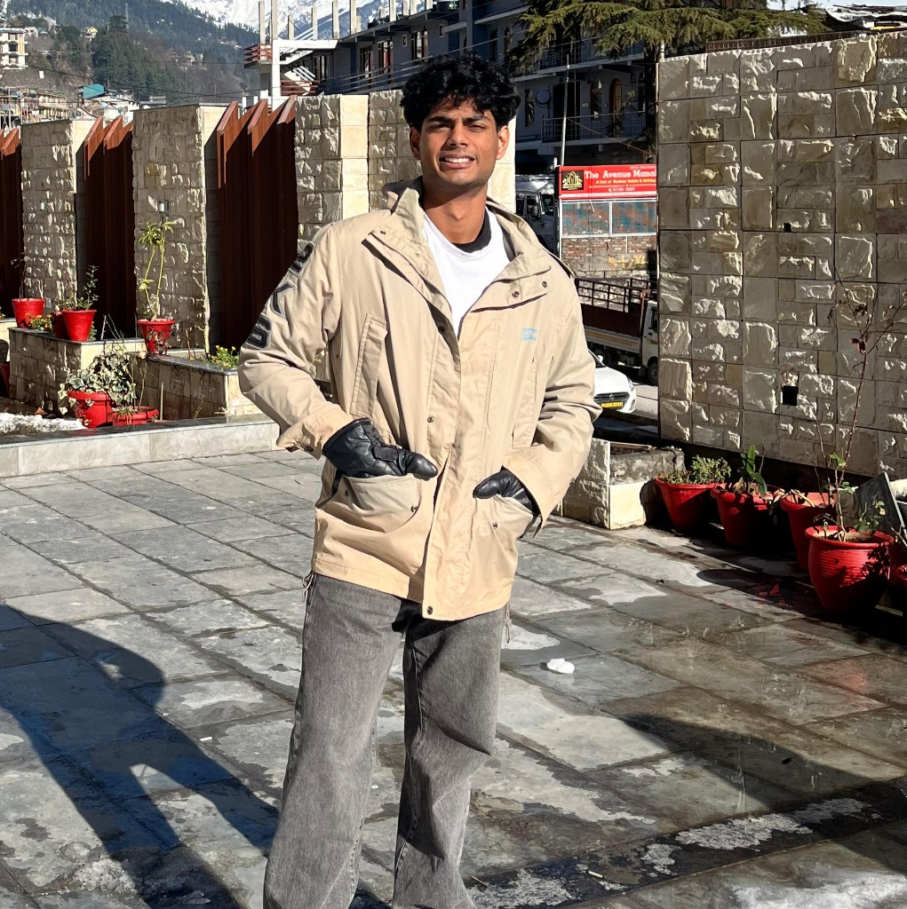

DEPLOYMENT LINK: https://portfolio-nu-ten-b8bg7s8ws7.vercel.app/

# Aryan Anand Fargose — Cinematic Interactive Portfolio

A premium, interactive personal portfolio website engineered with smooth frame-scrubbed canvas animation, cyber-minimalist dark aesthetics, and interactive project showcases.



---

## ⚡ Highlights & Key Features

- **300-Frame Scroll-Driven Canvas Engine**: Custom high-performance HTML5 Canvas renderer scrubbing through 300 sequential animation frames at 30 FPS, locked to scroll delta with fluid easing and seamless background blending (`#080c10`).
- **Initial Identity Reveal**: Cinematic monumental opening title (*ARYAN FARGOSE*) and portrait that gracefully dissolves into the interactive story narrative as you scroll.
- **Projects Matrix**:
  - 🌐 **[CampusHub](https://campus-hub-delta-green.vercel.app/)**: Centralized engineering platform connecting students with hackathons, internships, academic vaults, and community updates.
  - 🔍 **[GitSearch](https://git-search-rouge.vercel.app/)**: GitHub intelligence explorer featuring real-time user lookup, repository metrics, language breakdowns, and commit activity visualization.
- **Terminal System & Telemetry**: Interactive command terminal supporting commands (`help`, `skills`, `projects`, `contact`, `clear`) alongside technical capabilities across Full-Stack development, Cloud, and Systems.
- **Academic Timeline**: B.Tech in Information Technology at Dwarkadas J. Sanghvi College of Engineering (DJSCE), Mumbai (2025 – 2029).
- **Resume Integration**: In-app PDF quick-preview modal and one-click download access in the Transmission chapter.

---

## 🛠️ Tech Stack

- **Core**: HTML5, Canvas 2D API, Vanilla ES Modules JavaScript
- **Styling**: Vanilla CSS3, Glassmorphism, CSS Custom Properties, Responsive Fluid Grids
- **Build Tool**: [Vite](https://vitejs.dev/)

---

## 🚀 Quick Start

### 1. Clone the repository
```bash
git clone https://github.com/Aryan-Fargose/portfolio.git
cd portfolio
```

### 2. Install dependencies
```bash
npm install
```

### 3. Run development server
```bash
npm run dev
```
Open [http://localhost:3000](http://localhost:3000) in your browser.

### 4. Build for production
```bash
npm run build
```
Production assets will be bundled into the `dist/` directory.

---

## 📁 Project Structure

```
Portfolio/
├── public/
│   ├── frames/                 # 300 sequential animation frames (frame_001.jpg - frame_300.jpg)
│   ├── aryan-fargose.jpg       # Personal portrait
│   └── Aryan_Fargose_Resume.pdf# Academic and professional resume
├── src/
│   ├── canvas-renderer.js      # Dual-canvas caching & render loop
│   ├── scroll-controller.js    # Scroll progress normalization & chapter active states
│   ├── profile.js              # Interactive terminal emulator & modal controllers
│   ├── main.js                 # App bootstrap & event coordination
│   └── style.css               # Glassmorphism, animations, & typography
├── index.html                  # Semantic structure & story chapters
├── package.json
└── vite.config.js
```

---

## 👤 Author

**Aryan Anand Fargose**
- **Institution**: Dwarkadas J. Sanghvi College of Engineering (DJSCE), Mumbai
- **Degree**: B.Tech in Information Technology (2025 – 2029)
- **GitHub**: [@Aryan-Fargose](https://github.com/Aryan-Fargose)
- **Email**: [fargosearyan@gmail.com](mailto:fargosearyan@gmail.com)

---

## 📄 License
This project is open-source and available under the [MIT License](LICENSE).
